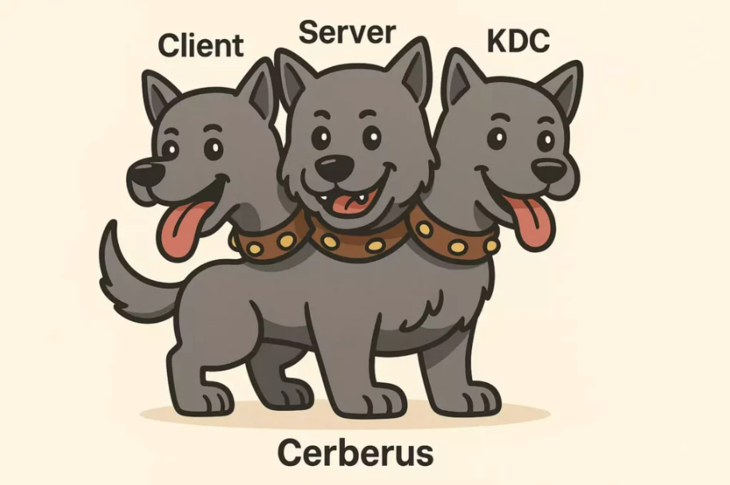
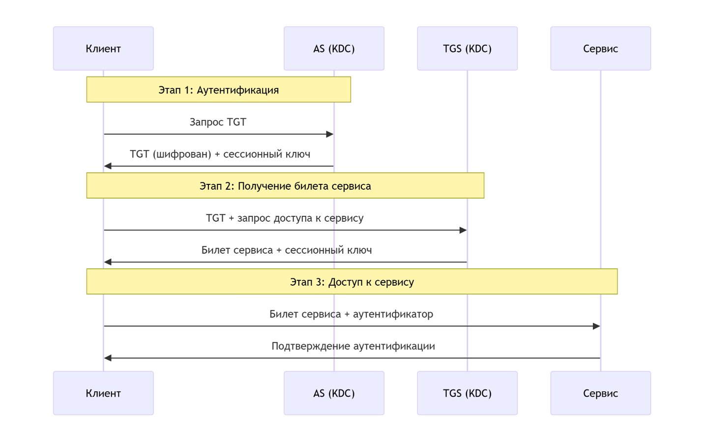

---
## Front matter
lang: ru-RU
title: Протокол Kerberos
subtitle: доклад
author:
  - Легиньких Г.А.
institute:
  - Российский университет дружбы народов, Москва, Россия

## i18n babel
babel-lang: russian
babel-otherlangs: english

## Formatting pdf
toc: false
toc-title: Содержание
slide_level: 2
aspectratio: 169
section-titles: true
theme: metropolis
header-includes:
 - \metroset{progressbar=frametitle,sectionpage=progressbar,numbering=fraction}
 - '\makeatletter'
 - '\beamer@ignorenonframefalse'
 - '\makeatother'
---
# Протокол Kerberos

## Введение

**Kerberos** — сетевой протокол аутентификации, разработанный в MIT в 1980-х годах.  
Используется для безопасного подтверждения личности в небезопасных сетях.

**Основные принципы:**
- Без передачи паролей по сети
- Взаимная аутентификация клиента и сервера
- Единый вход (Single Sign-On)
- На основе симметричного шифрования

---

## Три главных компонента

{ #fig:001 width=70% }

---

## Процесс аутентификации - 3 этапа

{ #fig:001 width=70% }

---

## Преимущества Kerberos

✅ **Безопасность** — пароли не передаются по сети  
✅ **Взаимная аутентификация** — проверяются и клиент, и сервер  
✅ **Единый вход** — один логин для всех сервисов  
✅ **Делегирование** — сервисы могут действовать от имени пользователя  
✅ **Стандартизация** — RFC 4120, поддержка в Windows, Linux, macOS

---

## Ограничения и сложности

⚠️ **Сложность настройки** — требует инфраструктуры KDC  
⚠️ **Зависимость от времени** — нужна точная синхронизация  
⚠️ **Единая точка отказа** — выход KDC из строя блокирует аутентификацию  
⚠️ **Управление ключами** — безопасное хранение мастер-ключей  
⚠️ **Межсетевое взаимодействие** — сложности с NAT и файрволами

---

## Kerberos в Active Directory

**Windows-реализация:**
- Каждый контроллер домена = KDC
- Интеграция с LDAP
- Автоматическая репликация
- Групповые политики для управления

**Особенности:**
- Прозрачная работа для пользователей
- Поддержка делегирования
- Междоменная аутентификация

---

## Практическое применение

**Корпоративные среды:**
- Windows домены
- UNIX/Linux интеграция через SSSD
- Аутентификация в сервисах (SQL, SharePoint, Exchange)

**Сетевые службы:**
- SSH с Kerberos
- Веб-серверы (Apache, IIS)
- Файловые системы (NFS, SMB)

**Облачные решения:**
- Azure Active Directory
- AWS Managed Microsoft AD

---

## Безопасность и атаки

**Защищено:**
- Перехват паролей
- Replay-атаки (благодаря временным меткам)
- Подделка билетов

**Уязвимости:**
- Golden Ticket (компрометация KDC)
- Silver Ticket (компрометация сервиса)
- Pass-the-ticket атаки
- Офлайн-брутфорс хэшей

**Меры защиты:** Сложные пароли, мониторинг, MFA

---

## Сравнение с другими протоколами

| Протокол | Тип | Преимущества | Недостатки |
|----------|-----|--------------|------------|
| **Kerberos** | Симметричный | SSO, взаимная аутентификация | Сложность, зависимость от KDC |
| **NTLM** | Challenge-response | Простота | Устаревший, односторонний |
| **OAuth 2.0** | Делегирование | Гибкость, для веб | Не для аутентификации |
| **SAML** | Федеративный | Межорганизационный | Сложность, XML |

---

## Заключение

**Kerberos остается**: Стандартом в корпоративных сетях, Надежным решением для внутренней аутентификации, основой безопасности Windows-доменов.